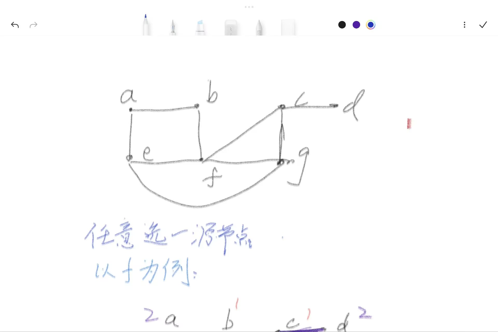
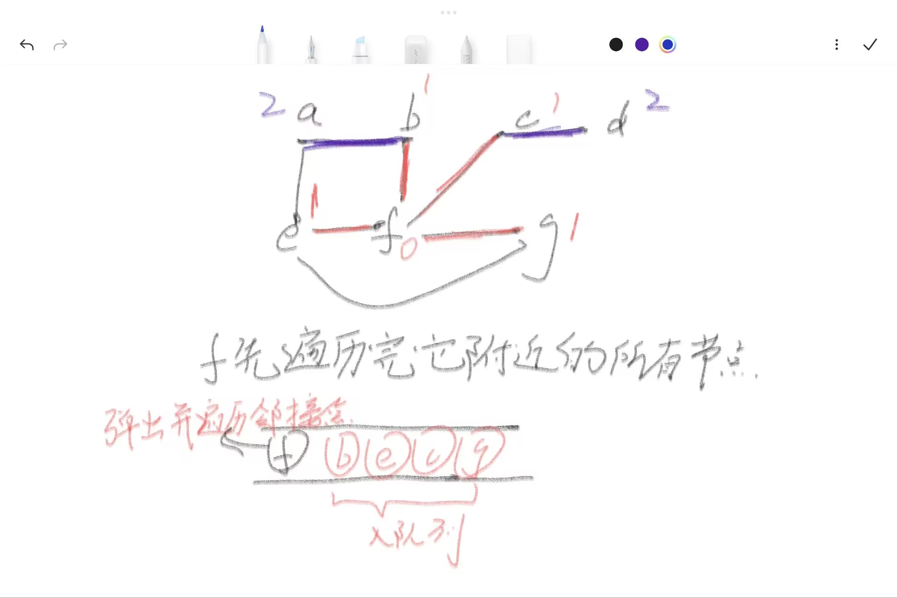
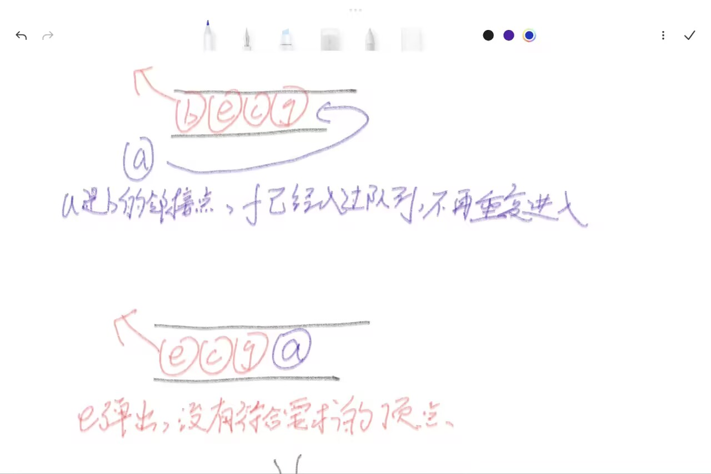
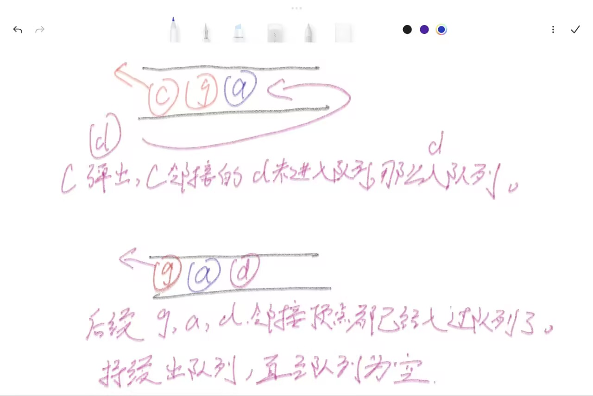
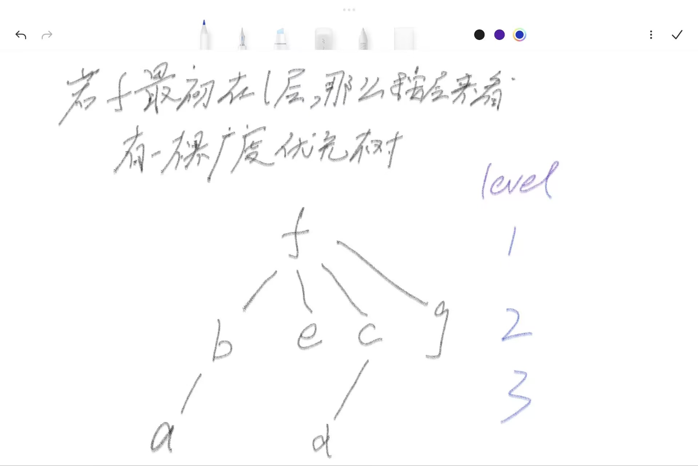
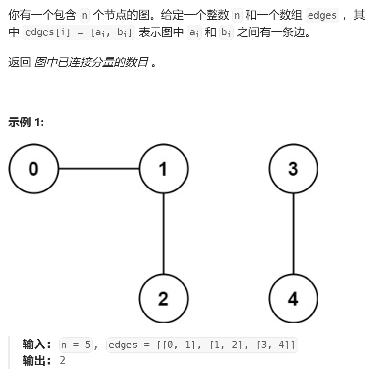
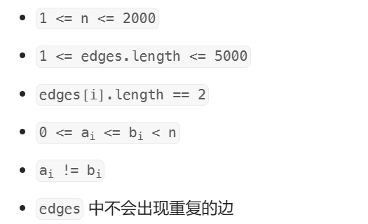
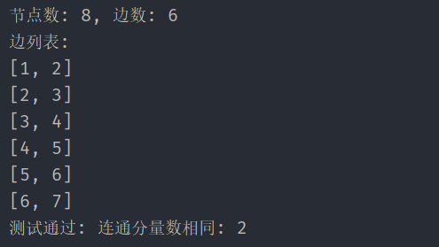
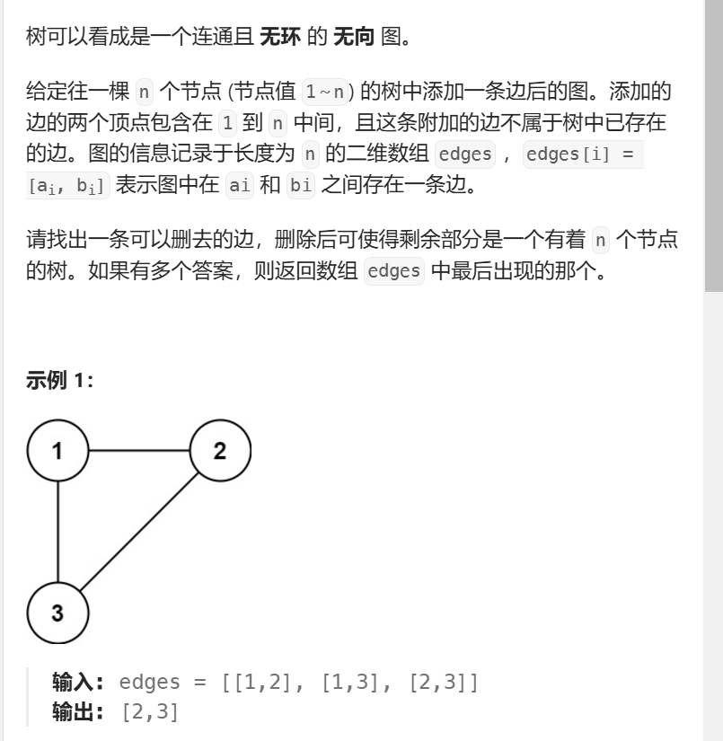

>广度优先遍历:宽度优先遍历（Breadth-First Search, BFS）, 图论和树论中基本的查找搜索算法， 是广大图算法的基础。

### 前置知识和介绍
**`数据结构`: 队列， 双端队列。 二叉树:经典bfs,按层bfs（即树的层序遍历）。**
**编程语言: Java**

广度优先遍历的细节和可玩性很高。  广度优先遍历英文名缩写是bfs。 所以，大佬口中的bfs☞广度优先遍历。 二叉树，多叉树中的层序遍历也是广度优先遍历。

广度优先遍历是很多算法的原型。
比如拓扑排序的kahn算法， Prim最小生成树算法， 单源最短路径算法Dijsktra。
>单单论广度优先遍历的变种：朴素广度优先遍历 => 按层广度优先遍历.
>多源广度优先遍历;
>01BFS;
>bfs与dfs结合生成路径;深度优先遍历和广度优先遍历打配合;
>bfs剪枝策略;
>双向广搜;

本篇只介绍基础部分的内容
### 广度优先遍历
以下内容均用bfs代替广度优先遍历。
用途：
- 遍历图中所有的顶点。
- 遍历所有顶点的路径。
- **无向不带权图， 或者带权图权重相同且权重为正值）， 求两点之间的最短路径。**
- **图的连通性检验， 图连通分量求解**
- kahn，Prim，Dijsktra... 图算法都是bfs的变种实现。

下面是无向图的bfs
具体图解一下（~~平板上手写字有点丑， 对不起对不起对不起~~）:
以如下图为例
bfs在于选择一个源节点开始扩散， 这里以f为例。


先将f的邻接点b,e,c，g遍历一遍。然后再对b,e,c,g邻接且为访问过的顶点进行遍历。


这里实现需要借助队列（先进先出的结构）， 和哈希集合（用于记忆化搜索，避免重复遍历， 优化效率）。


总而言之就是入队列是将这个点加入哈希集合中， 出队列就把它所有的未在哈希集合顶点加入到队列。
算法流程和代码实现在下文处有详解。

`如果以最初的源头节点f标记为第一层，那么b,e,c,g就是第二层，a,d在第三层， 可以得到如下广度优先树。`

这棵树是bfs在无向图中以源节点f的生成树。

这里简单给几个结论吧。
1. 无向连通图中， 以某个节点扩散， 会得到以该节点为根节点的生成树（广度优先树）。
2. 以src节点进行按层扩散， 朴素bfs不明显地区分层，但是按层的顺序。优化bfs（按层bfs）就把这个特征显示地展现了。=>这里类比经典二叉树层序遍历和优化层序遍历。
3. 可以求解src到dest的最短边数， 比如，f->d点经过的最短边数是2。 需要处理f->d的所有简单路径然后挨个比大小吗？ bfs当然不需要， 因为它总是处理完离源节点为k长度的所有节点，然后才处理k+1长度的节点。 bfs的性质。
4. 前面提过，bfs可以解决最短路径问题。 不过这种最短路径的方法的使用条件必须记住。怎么说呢？毕竟bfs是相对"底层"的图算法， 最短路径算法有Bellman-Ford, A*, SPFA,Dijktra算法,它们的限制和使用条件也不尽相同。 我想说bfs使用限制应该相较于上述的最短路径算法要更加局限。
使用条件：1. 无权图：这种情况等价于3求最短边问题。 2：带权图： a->b且b->a的相互权重相同， 且权重不为负值，不需要所有边权重都统一。

说了这么多， 你可能会吐槽， "我怎么记得住呢？" 下面先介绍算法流程，代码实现，然后我会以bfs求解图中连通分量问题， 无向图判环， 有向图判环来辅助理解这些性质


### 广度优先遍历的基本实现
这里重申一遍上面用过的容器
1. **需要队列这种数据结构辅助。**
由于BFS需要由近到远的处理， 队列这种先进先出的结构可以总是让距离近的顶点先被处理。 因此广度优先遍历需要队列存储顶点和维护顺序。
2. **需要哈希表（哈希集合）来标记已访问节点。**
BFS适用于无向图和带环图， 必须标记已访问的节点， 否则可能会陷入死循环重复处理同一节点或者困于环中。有个名词，记忆化搜索， 就是这个。

以下是朴素广度优先遍历的Java实现
>算法流程：
> 1. 给定一个源节点s, 将其加入队列， 并用哈希表标记开始遍历。
> 2. 弹出对头的节点，并扫描它的所有关联的顶点， 若当前关联顶点未标记过那么加入队列。
> 3. 重复2过程直至队列为空， 弹出对头节点时可以进行额外处理（比如打印，收集...）。

三种建图方式实现
任选一种你喜欢的方式即可。

`链式前向星`：
```java
package BFS;


public class Code01_BFS {
    //链式前向星的bfs写法
    public static int MAXN = 1001;
    public static int MAXM = 2003;
    public static int[] head = new int[MAXN];
    public static int[] next = new int[MAXM];
    public static int[] to = new int[MAXM];
    public static int cnt;
    public static int[] queue = new int[MAXN];
    public static int l,r;
    public static boolean[] visited = new boolean[MAXN];
    //把0编号空出来
    public static void build(int n){
        for(int i=1;i<=n;i++){
            head[i] = 0;
            visited[i] = false;
        }
        cnt = 1;
    }
    //添加一条有向边u->v
    //无向边就交换参数多调一次这个。
    public static void addEdge(int u,int v){
        next[cnt] = head[u];
        to[cnt] = v;
        head[u] = cnt++;
    }
    public static void bfs(int start){
        if(start == 0) {
            return;
        }
        queue[r++] = start;
        visited[start] = true;
        while(l != r){
            int cur = queue[l++];
            //这里可以处理cur...打印，收集，处理信息...
            System.out.print(cur+" ");
            for(int ei = head[cur]; ei != 0;ei = next[ei]){
                int dst = to[ei];
                if(!visited[dst]){
                    queue[r++] = dst;
                    visited[dst] = true;//标记已访问过
                }
            }
        }
    }
    // 主函数
    public static void main(String[] args) {
        build(6); // 假设图有6个节点
        //这种图结构
        //1 -> 2, 3
        //2 -> 4, 5
        //3 -> 6
        addEdge(1, 2);
        addEdge(1, 3);
        addEdge(2, 4);
        addEdge(2, 5);
        addEdge(3, 6);

        System.out.println("BFS traversal starting from node 1:");
        bfs(1); // 从节点1开始BFS遍历
    }
}

```

`邻接矩阵`:
```java
package BFS;

public class Code02_BFS_Matrix {
    public static int MAXN = 101;
    public static int[][] graph = new int[MAXN][MAXN];
    public static int[] queue = new int[MAXN];
    public static int l,r;
    public static boolean[] visited = new boolean[MAXN];
    public static int n;
    public static void build(){
        for(int i=1;i<=n;i++){
            for(int j=1;j<=n;j++){
                graph[i][j] = 0;
            }
            visited[i] = false;
        }
    }
    //添加有向不带权边。u->v
    //无向边交换参数又调一次。
    public static void addEdge(int u,int v){
        graph[u][v] = 1;
    }
    public static void bfs(int start){
        if(start == 0) {
            return;
        }
        queue[r++] = start;
        visited[start] = true;
        while(l != r){
            int cur = queue[l++];
            //这里可以处理cur...打印，收集，处理信息...
            System.out.print(cur + " "); // 处理当前节点（这里是打印）
            for(int next=1;next<=n;next++){
                if(graph[cur][next]==1&&!visited[next]){
                    queue[r++] = next;
                    visited[next] = true;
                }
            }
        }
    }
    // 主函数
    public static void main(String[] args) {
        n = 6;
        build(); // 构建图，假设图中有6个节点
        //这种图结构
        //1 -> 2, 3
        //2 -> 4, 5
        //3 -> 6
        addEdge(1, 2);
        addEdge(1, 3);
        addEdge(2, 4);
        addEdge(2, 5);
        addEdge(3, 6);

        System.out.println("BFS traversal starting from node 1:");
        bfs(1); // 从节点1开始进行BFS遍历
    }
}

```

`邻接表`：
```java
package BFS;

import java.util.ArrayDeque;
import java.util.ArrayList;
import java.util.HashSet;
import java.util.Queue;

public class Code03_BFS_List {
    // 邻接表方式建图
    public static ArrayList<ArrayList<Integer>> graph = new ArrayList<>();

    public static  void build(int n){
        graph.clear();
        for(int i=0;i<=n;i++){
            graph.add(new ArrayList<>());
        }
    }
    public static void addEdge(int u,int v){
        graph.get(u).add(v);
    }

    public static void bfs(int start){
        if(start == 0){
            return ;
        }
        //动态队列和哈希表
        Queue<Integer> queue = new ArrayDeque<>();
        HashSet<Integer> set = new HashSet<>();
        queue.add(start);
        set.add(start);
        while(!queue.isEmpty()){
            int cur = queue.poll();
            //处理打印
            System.out.print(cur + " "); // 处理当前节点（这里是打印）
            for(int next:graph.get(cur)){
                if(!set.contains(next)){
                    set.add(next);
                    queue.add(next);
                }
            }
        }
    }
    // 主函数
    public static void main(String[] args) {
        build(6); // 假设图有6个节点
        //这种图结构
        //1 -> 2, 3
        //2 -> 4, 5
        //3 -> 6
        addEdge(1, 2);
        addEdge(1, 3);
        addEdge(2, 4);
        addEdge(2, 5);
        addEdge(3, 6);

        System.out.println("BFS traversal starting from node 1:");
        bfs(1); // 从节点1开始BFS遍历
    }
}

```

---

### 无向图连通分量
[无向图连通分量:会员题](https://leetcode.cn/problems/number-of-connected-components-in-an-undirected-graph/description/)
：会员朋友们可以提交前面两个并查集和bfs的解法;
非会员下面会提供对数器，(并查集和bfs求解连通分量相互验证), 自行改数据和debug，输入测试样例测数据。
非Java的朋友， 借助ChatGPT转换即可。


`数据范围:`



如果你了解并查集， 那么自然对连通分量并不陌生。
这里依然给出连通分量的概念：
>对于无向图而言，一个极大连通子图为一个连通分量。
所有连通分量构成互相没有相同顶点的子图集合。
人话：就是一个图中的完全连通的区域， 比如上述示例1中：{0，1，2}，{3，4}它们是图中独立的连通子区域。连通子图。

`并查集解法`：不了解并查集没关系， 可以略过此部分后续学习。
并查集初始化是每个元素都是一个小的集合,`设计sets变量, sets = n`,假设初始时连通分量是n， 遍历图中所有的边，将关联到端点进行合并， 每成功合并一次那么实际预期的连通分量就减少1。 最终剩余的sets就是实际的连通分量数目。
```java
class Solution {
    public static int MAXN = 2001;
    public static int[] father = new int[MAXN];
    public static int sets;
    public static void build(int n){
        for(int i = 0;i < n;i++){
            father[i] = i;
        }
        sets = n;
    }
    public static int find(int i){
        if(father[i]!=i){
            father[i] = find(father[i]);
        }
        return father[i];
    }
    public static void union(int x,int y){
        int fx = find(x);
        int fy = find(y);
        if(fx != fy){
            sets--;
            father[fx] = fy;
        }
    }
    public int countComponents(int n, int[][] edges) {
        build(n);
        for(int[] edge:edges){
            union(edge[0],edge[1]);
        }
        return sets;
    }
}
```
这个方法是正确的。

`下面介绍bfs`

算法流程:
1. 选择一种建图方式（这里以链式前向星建图）， 初始化队列，布尔数组（哈希集合）
2. 遍历所有顶点，如果当前src顶点不在哈希集合那么对它做bfs, bfs过程将所有与bfs和它本身标记（进入布尔数组中），重复直至所有顶点遍历完毕。
3. 统计多少个节点做了bfs， 节点数目就是该图的连通分量数目。
```java
class Solution {
    public static int MAXN = 2001;
    public static int MAXM = 10001;
    public static int[] head = new int[MAXN];
    public static int[] next = new int[MAXM];
    public static int[] to = new int[MAXM];
    public static int[] queue = new int[MAXN];
    public static int l,r;
    public static boolean[] visited = new boolean[MAXN];
    public static int cnt;

    public static void build(int n) {
        cnt = 1;
        Arrays.fill(head, -1); // 初始化head数组
        Arrays.fill(visited, false);//初始化哈希集合。
    }

    public static void addEdge(int u, int v) {
        next[cnt] = head[u];
        to[cnt] = v;
        head[u] = cnt++;
    }

    public int countComponents(int n, int[][] edges) {
        build(n);
        // 构建图的邻接表
        for (int[] edge : edges) {
            addEdge(edge[0], edge[1]);
            addEdge(edge[1], edge[0]);
        }
        int ans = 0;
        // 使用队列进行 BFS
        for (int i = 0; i < n; i++) {
            if (!visited[i]) {
                l = r = 0;
                queue[r++] = i;
                visited[i] = true;
                while (l != r) {
                    int cur = queue[l++]; // 取出队列头部的元素
                    // 遍历所有与当前节点相连的邻居
                    for (int ei = head[cur], dest; ei != -1; ei = next[ei]) {
                        dest = to[ei];
                        if (!visited[dest]) {
                            queue[r++]=dest;
                            visited[dest] = true;
                        }
                    }
                }
                // 每次从一个未访问的节点开始 BFS，说明发现了一个新的连接分量
                ans++;
            }
        }
        return ans;
    }

}

```


`对数器测试`:

```java
package BFS;

import java.util.*;
public class Code05_ConnectedComponent {
    public static void main(String[] args) {
        // 随机数生成器
        Random rand = new Random();

        // 随机生成节点数 n，确保 n >= 2
        int n = rand.nextInt(6) + 5; // n 在 5 到 10 之间

        // 生成两个连通分量
        List<int[]> edges = new ArrayList<>();

        // 随机生成分割点
        int mid = rand.nextInt(n - 1) + 1; // mid 介于 1 和 n-1 之间，分成两部分

        // 第一部分，连接节点 0 到 mid-1
        for (int i = 0; i < mid - 1; i++) {
            edges.add(new int[]{i, i + 1}); // 连接 0 和 1, 1 和 2 等等
        }

        // 第二部分，连接节点 mid 到 n-1
        for (int i = mid; i < n - 1; i++) {
            edges.add(new int[]{i, i + 1}); // 连接 mid 和 mid+1, mid+1 和 mid+2 等等
        }

        // 打印生成的测试用例
        System.out.println("节点数: " + n + ", 边数: " + edges.size());
        System.out.println("边列表:");
        for (int[] edge : edges) {
            System.out.println(Arrays.toString(edge));
        }

        // 实例化并调用 Solution1
        Solution1 solution1 = new Solution1();
        int result1 = solution1.countComponents(n, edges.toArray(new int[0][]));

        // 实例化并调用 Solution
        Solution solution = new Solution();
        int result2 = solution.countComponents(n, edges.toArray(new int[0][]));

        // 比较两个结果
        if (result1 == result2) {
            System.out.println("测试通过: 连通分量数相同: " + result1);
        } else {
            System.out.println("测试失败: Solution1 = " + result1 + ", Solution = " + result2);
        }
    }

    static class Solution1 {
        public static int MAXN = 2001;
        public static int[] father = new int[MAXN];
        public static int sets;

        public static void build(int n) {
            for (int i = 0; i < n; i++) {
                father[i] = i;
            }
            sets = n;
        }

        public static int find(int i) {
            if (father[i] != i) {
                father[i] = find(father[i]);
            }
            return father[i];
        }

        public static void union(int x, int y) {
            int fx = find(x);
            int fy = find(y);
            if (fx != fy) {
                sets--;
                father[fx] = fy;
            }
        }

        public int countComponents(int n, int[][] edges) {
            build(n);
            for (int[] edge : edges) {
                union(edge[0], edge[1]);
            }
            return sets;
        }
    }

    static class Solution {
        public static int MAXN = 2001;
        public static int MAXM = 10001;
        public static int[] head = new int[MAXN];
        public static int[] next = new int[MAXM];
        public static int[] to = new int[MAXM];
        public static int[] queue = new int[MAXN];
        public static int l, r;
        public static boolean[] visited = new boolean[MAXN];
        public static int cnt;

        public static void build(int n) {
            cnt = 1;
            Arrays.fill(head, -1); // 初始化head数组
            Arrays.fill(visited, false); // 初始化哈希集合。
        }

        public static void addEdge(int u, int v) {
            next[cnt] = head[u];
            to[cnt] = v;
            head[u] = cnt++;
        }

        public int countComponents(int n, int[][] edges) {
            build(n);
            // 构建图的邻接表
            for (int[] edge : edges) {
                addEdge(edge[0], edge[1]);
                addEdge(edge[1], edge[0]);
            }
            int ans = 0;
            // 使用队列进行 BFS
            for (int i = 0; i < n; i++) {
                if (!visited[i]) {
                    l = r = 0;
                    queue[r++] = i;
                    visited[i] = true;
                    while (l != r) {
                        int cur = queue[l++]; // 取出队列头部的元素
                        // 遍历所有与当前节点相连的邻居
                        for (int ei = head[cur], dest; ei != -1; ei = next[ei]) {
                            dest = to[ei];
                            if (!visited[dest]) {
                                queue[r++] = dest;
                                visited[dest] = true;
                            }
                        }
                    }
                    // 每次从一个未访问的节点开始 BFS，说明发现了一个新的连接分量
                    ans++;
                }
            }
            return ans;
        }
    }
}

```


自己修改对应的数据， 自己测试着玩。

---


### 判环问题
[冗余连接](https://leetcode.cn/problems/redundant-connection/description/)
一道判断图中有无环的题。


图中判环可以暴力地用bfs和dfs解决。
这道题第一句话树可以看成一个连通且无环的无向图。 这句话暗示我们建图， 只要把这棵树以图的形式组织起来， 那么判环问题就迎刃而解了。
算法流程：
1. 选择一种你喜欢的建图的方式。
2. 在建图过程中， 每增加一条边$(u,v)$之前，查询u->v是否存在通路，如果存在通路，那么$(u,v)$这条边添加进去就会形成回路;否则,将这条边添加进去。

`bfs判环`
```java
class Solution {
    public static int MAXN = 1001;
    public static List<List<Integer>> graph = new ArrayList<>();
    public static int[] queue = new int[MAXN];
    public static int l, r;
    public static boolean[] set = new boolean[MAXN];

    public int[] findRedundantConnection(int[][] edges) {
        int n = edges.length;
        graph.clear();
        for (int i = 0; i <= n; i++) {
            graph.add(new ArrayList<>());
        }
        int u, v;
        for (int[] edge : edges) {
            u = edge[0];
            v = edge[1];
            if (bfs(u, v)) {
                return new int[] { u, v };
            }
            graph.get(u).add(v);
            graph.get(v).add(u);
            Arrays.fill(set, 0, n + 1, false);
        }
        return null;

    }

    public static boolean bfs(int u, int v) {
        l = r = 0;
        queue[r++] = u;
        while (l != r) {
            int cur = queue[l++];
            set[cur] = true;
            for (int next : graph.get(cur)) {
                if (next == v)
                    return true;
                if (!set[next]) {
                    queue[r++] = next;
                }
            }
        }
        return false;
    }
}
```


bfs暴力确实可以解决。
图的判环
一般地，dfs比bfs在判环上更优， 毕竟深度优先递归很容易剪纸。 而bfs对于稠密图来说不仅费空间，时间上效率也不高。暴力dfs判环还是暴力bfs判环都是糟糕的做法。
实际上，对于无向图，采用并查集才是最优解。如果两个元素位于同一集合， 那么并查集的合并操作就不会执行， 那么这说明了该连通分量成环了。
对于有向图判环， 要采用后面的拓扑排序算法。 拓扑排序就是优化判环的bfs和dfs的体现，拓扑排序的dfs（Tarjan算法）和bfs(kahn算法)相比暴力提高了很多效率。

以下是本题并查集的解法
```java
class Solution {
    public static int MAXN = 1001;
    public static int[] father = new int[MAXN];
    public static void build(int n){
        for(int i=1;i<=n;i++){
            father[i] = i;
        }
    }

    public static int find(int i){
        if(father[i] != i){
            father[i] = find(father[i]);
        }
        return father[i];
    }

    public static boolean union(int x,int y){
        int fx = find(x);
        int fy = find(y);
        if(fx != fy){
            father[fy] = fx;
            return true;
        }
        return false;
    }
    public int[] findRedundantConnection(int[][] edges) {
        int n = edges.length;
        build(n);
        for(int[] edge:edges){
            if(!union(edge[0], edge[1])){
                return new int[]{edge[0], edge[1]};
            }
        }      
        return null; 
    }
}
```


### 总结
本篇是bfs的介绍， 但也提到了有关并查集的篇幅。 并查集在求解连通分量和无向图判环上大显神威。
bfs：3种图结构实现， bfs求解连通分量， bfs暴力判环， bfs测试两点之间是否存在通路这些。
bfs要借助队列这种结构辅助， 写bfs算法基本要加队列， 另外要哈希集合来记忆化搜索等。

由于篇幅有限， bfs的部分只停留在基础的部分。 有关更多bfs的拓展及其变种算法， 后续有空再写写吧。

