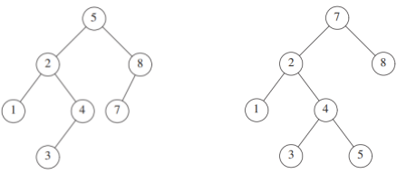

### 一.有序表概述

有序表可以理解C++/Java中的抽象类; \从数据结构角度出发,
它是一种抽象数据结构。它提供实现功能需求，但没有要求严格的具体实现。

对比熟悉无序表(通常是哈希表);
哈希表特点，它的关键字$key$不是有序组织的， 它通过哈希函数打乱离散分布的结果。
有序表实现的方式就是花费一些代价， 将这些关键字key顺序组织起来， 对比无序表它可以实现丰富有序的操作。

若你没有听说过有序表的概念， 那么看完上面的文字， 大概对有序表的实现有概念了吧。 
比方说，尝试用一个数组有序的组织数据， 或者有序维护单向双向链表等等。\
答案是否定的， 有序表还有一个特点， 它必须保证足够高的效率。\
具体, 保证**增删查改**操作均达到$O(logn)$的水平， 有序数组增删操作最坏是$O(n)$，有序链表查询操作最坏是$O(n)$。

>数据结构的抽象描述是这样的:元素按一定顺序(一般非降序或非升序)排列、且可支持高效检索或操作的一类线性表(或广义表).

### 二.实现有序表的数据结构
常见实现有序表的数据结构:
1. **有序数组**: 尽管增删$O(n)$, 但支持**二分查找$O(logn)$**。 实现简单，多查少改场景适用。
2. **链表(跳表)**:单个有序链表组织没有查询优势，但层级有序链表即跳表， 实现全$O(logn)$操作。
3. (自)平衡树结构:数据结构两大阴间->**AVL树，红黑树**. 竞赛版:**替罪羊树，Treap，FHQ Treap,Splay树**; 其它的比如数据库中的**B树，B*变种，2-3树,2-3-4树**这些。有些场景**线段树和树状数组**也可以充当有序表。

### 正文开始:前言
本篇介绍AVL树的算法模板静态数组实现， 有关于类模板(动态空间使用，释放)实现笔者暂时不更。 

**前置知识: 数据结构-二叉搜索树**\
**编程语言:C++.** 后续会补充Java版本.

### 目录部分
- [AVL树](###AVL树)
### 一. AVL树

我们知道，二叉搜索树的API时间复杂度为$O(h),h为树高$, 最坏时间复杂度$O(n)$。\
我们又知道一棵n个节点的树， 它的高度下界是$O(logn)$。 对于普通的二叉搜索树, 它是效率是取决于树高的。 若树在经过增删后变得极不平衡，那么它的api效率就会下降。 为此，我们希望这棵树能自动平衡，而不需要人为干预或者重新建树等。

AVL树就是最早发明的平衡二叉树， 它是具有自平衡性的二叉搜索树。

本篇介绍AVL树实现有序表。

#### 1. 性质
$平衡性: 任意子树上，左右高度差的绝对值≤1。$
\
$高效性: 增删查修操作均为O(logn)。$\
$有序性: 关键字key按照一定顺序组织起来。$

#### 2. 空间编号
由于采取静态空间实现， 使用树的数组方式存储。
对所有节点进行编号，其中0编号作为节点没有孩子的标志。

