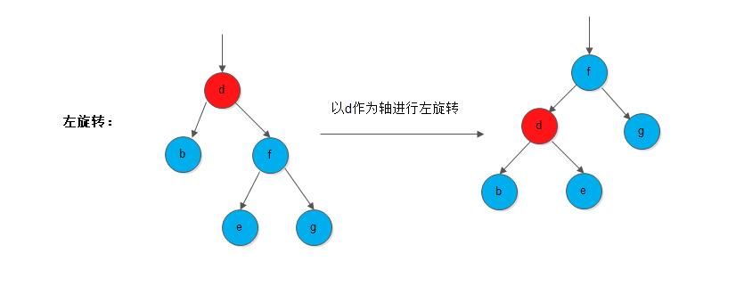
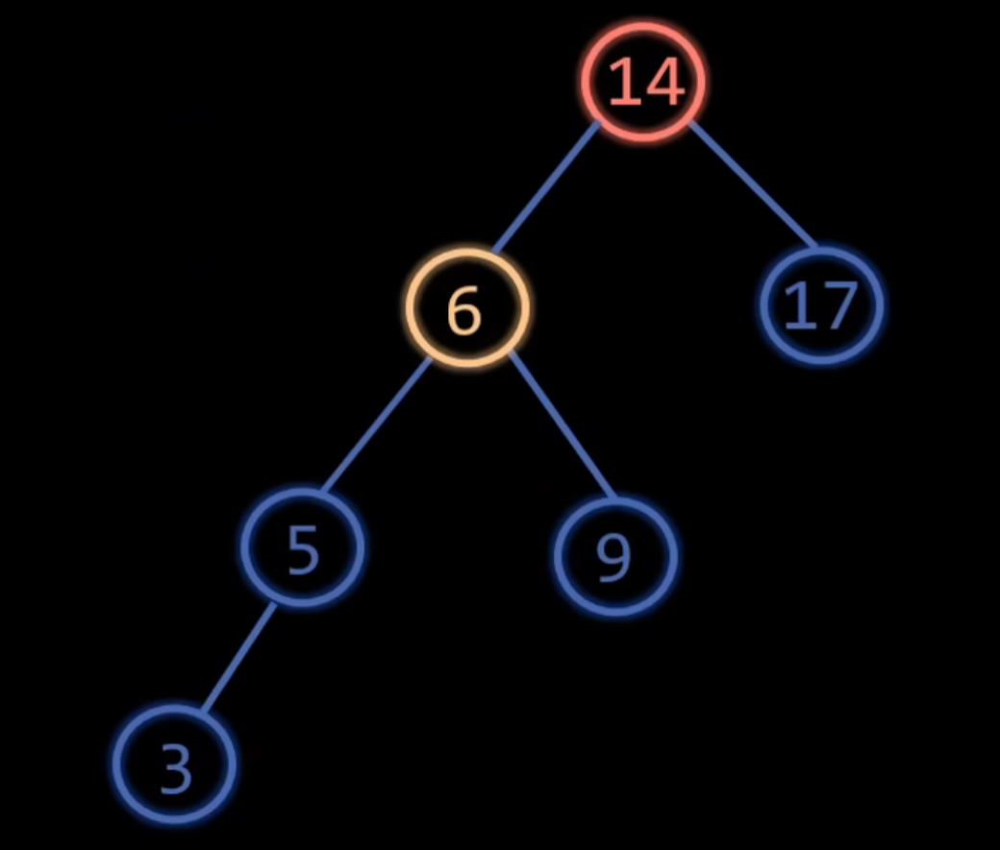

### 一.有序表概述

有序表可以理解C++/Java中的抽象类; \从数据结构角度出发,
它是一种抽象数据结构。它提供实现功能需求，但没有要求严格的具体实现。

对比熟悉无序表(通常是哈希表);
哈希表特点，它的关键字$key$不是有序组织的， 它通过哈希函数打乱离散分布的结果。
有序表实现的方式就是花费一些代价， 将这些关键字key顺序组织起来， 对比无序表它可以实现丰富有序的操作。

若你没有听说过有序表的概念， 那么看完上面的文字， 大概对有序表的实现有概念了吧。 
比方说，尝试用一个数组有序的组织数据， 或者有序维护单向双向链表等等。\
答案是否定的， 有序表还有一个特点， 它必须保证足够高的效率。\
具体, 保证**增删查改**操作均达到$O(logn)$的水平， 有序数组增删操作最坏是$O(n)$，有序链表查询操作最坏是$O(n)$。

>数据结构的抽象描述是这样的:元素按一定顺序(一般非降序或非升序)排列、且可支持高效检索或操作的一类线性表(或广义表).

### 二.实现有序表的数据结构
常见实现有序表的数据结构:
1. **有序数组**: 尽管增删$O(n)$, 但支持**二分查找$O(logn)$**。 实现简单，多查少改场景适用。
2. **链表(跳表)**:单个有序链表组织没有查询优势，但层级有序链表即跳表， 实现全$O(logn)$操作。
3. (自)平衡树结构:数据结构两大阴间->**AVL树，红黑树**. 竞赛版:**替罪羊树，Treap，FHQ Treap,Splay树**; 其它的比如数据库中的**B树，B*变种，2-3树,2-3-4树**这些。有些场景**线段树和树状数组**也可以充当有序表。


### 前言
本篇介绍AVL树的算法模板静态数组实现， 有关于类模板(动态空间使用，释放)实现笔者暂时不更。 

**前置知识: 数据结构-二叉搜索树**\
**编程语言:C++.** 后续会补充Java版本.

本文基于如下链接实现的AVL树
[Luogu3369:普通平衡树](https://www.luogu.com.cn/problem/P3369)

实现了如下操作:
插入、删除、获取关键字的排名、获取排名的关键字，查找前驱和后继等基础功能.
本篇实现了有序表集而非有序表映射， 笔者可以根据下面代码扩展对应的功能。

---


**正文部分**

---
# 目录

1. [概述](#概述)
2. [数据结构与全局变量](#数据结构与全局变量)
3. [辅助函数](#辅助函数)
    - [更新节点信息 (`up`)](#更新节点信息-up)
    - [左旋操作 (`leftRotate`)](#左旋操作-leftrotate)
    - [右旋操作 (`rightRotate`)](#右旋操作-rightrotate)
    - [维护平衡 (`maintain`)](#维护平衡-maintain)
4. [主要操作函数](#主要操作函数)
    - [插入操作 (`add`)](#插入操作-add)
    - [删除操作 (`remove`)](#删除操作-remove)
    - [获取排名 (`getRank`)](#获取排名-getrank)
    - [查找前驱 (`pre`)](#查找前驱-pre)
    - [查找后继 (`post`)](#查找后继-post)
    - [获取第 K 小元素 (`getIndex`)](#获取第-k-小元素-getindex)
5. [辅助功能](#辅助功能)
    - [清空树 (`clear`)](#清空树-clear)
6. [主函数](#主函数)
7. [总结](#总结)

---

## 概述

二叉搜索树的时间复杂度依赖高度$O(h)$, 最坏是$O(n)$.
能否实现一棵自动平衡的树， 将高度h控制在下界$logn$.
AVL树是最早提出满足这种要求的树。 它对平衡性的定义非常严格。

针对一般的二叉搜索树， 若采用动态实现的方式， 那么在经过插入或者删除可能会破坏树的平衡性。AVL树通过旋转这种检查调整的操作， 每次插入和删除都会进行这样的检测并将树调整平衡。
理解旋转操作是实现AVL树的重点。

## 数据结构与全局变量

```cpp
const static int N = 1e6+10;//数据范围

int head = 0; // AVL树的根节点
int cnt; // 当前最后使用过节点的编号
int key[N]; // 节点的值
int height[N]; // 节点的高度
int leftChild[N]; // 节点的左子节点
int rightChild[N]; // 节点的右子节点
int key_count[N]; // 节点值的重复次数
int size[N]; // 子树大小
```

- **`head`**: AVL 树的根节点编号。
- **`cnt`**: 用于分配新的节点编号。
- **`key`**: 存储每个节点的值。
- **`height`**: 存储每个节点的高度。
- **`leftChild` 和 `rightChild`**: 存储每个节点的左子节点和右子节点的编号。
- **`key_count`**: 处理重复元素，记录每个值的出现次数。
- **`size`**: 记录每个节点所在子树的总节点数（包括重复计数）。

下面我解释一下为什么引入某些数组?
1. 由于本题要求记录关键字， 但不需要存储键值对。 因此不需要映射关系的`value`数组。
2. 由于AVL树的定义，需要记录当前节点的树高信息来维护平衡性， 需要`height`数组。
3. 本题可以重复添加关键字。 针对重复关键字可以采取词频统计的方式。避免了为重复关键字分配节点编号。 引入`key_count`数组。
4. 本题要计算排名引入一个`size数组`记录以当前节点为根节点的子树大小可以简化计算。
5. 采用递归实现，因此不需要`parent`数组记录每个节点的双亲节点编号。

## 辅助函数

### 更新节点信息 (`up`)

```cpp
//更新size,height信息。 根据孩子更新信息
void up(int i){
  size[i] = size[leftChild[i]]+size[rightChild[i]]+key_count[i];
  height[i] = max(height[leftChild[i]], height[rightChild[i]]) + 1;
}
```

- **功能**: 根据当前节点的左右子节点信息，更新当前节点的 `size` 和 `height`。
- **参数**: `i` - 当前节点编号。

### 左旋操作 (`leftRotate`)
左旋操作
左旋操作的理解要点是:
节点i和它右孩子的颠倒父子关系; 同时这种操作不会破坏二叉搜索树的性质;理解这过程左右树高的变化。



如下代码流程:
1. 定义变量r, `r=rightChild[i]`
2. 让`r`的左孩子成为`i`的右孩子。(i对r的单向父亲关系解除了)
3. 让i成为r的左孩子(r对i绑定父子关系)。
4. i在r下面， 先对下面的i整合信息更新$up(i)$， 再对$up(r)$的正确。
5. 由于原先以i节点为根的子树变成r为根节点， 向上返回r为左旋后的新节点。
```cpp
int leftRotate(int i){
  int r = rightChild[i];
  rightChild[i] = leftChild[r];
  leftChild[r] = i;
  up(i);
  up(r);
  return r;
}
```

- **功能**: 对节点 `i` 进行左旋，保持 AVL 树的平衡。
- **返回值**: 旋转后新的根节点编号。

### 右旋操作 (`rightRotate`)
右旋操作
右旋操作的理解要点和左旋操作一致。 可以视作左旋的对称过程。
可以通过下面图片和代码结合起来理解。


```cpp
int rightRotate(int i){
  int l = leftChild[i];
  leftChild[i] = rightChild[l];
  rightChild[l] = i;
  up(i);
  up(l);
  return l;
}
```

- **功能**: 对节点 `i` 进行右旋，保持 AVL 树的平衡。
- **返回值**: 旋转后新的根节点编号。

### 维护平衡 ---四种旋转方式(`maintain`)

如果当前节点i满足AVL树的平衡性定义$|lh-rh| ≤ 1$. 那么不需要调整。
否则，节点i违规了需要调整，
这里先大致分成两种情况。
即L型和R型，
- L型意味左高右低， 需要右旋调整。
- R型意味右高左低， 需要左旋调整。 

先看L型， 仅仅对违规节点i进行右旋可能不够。
因为只进行右旋可能仍然处于失衡状态, 旋转不一定会减少左右树高的差。
由此又分为LL型，与LR型。
区分LL型和LR型的条件是看i左子树的左右子树树高。

比如下图中i是左右

```cpp
int maintain(int i){
  int lh = height[leftChild[i]];
  int rh = height[rightChild[i]];
  if(lh - rh > 1){
    // 左子树高，需要右旋
    if(height[leftChild[leftChild[i]]] >= height[rightChild[leftChild[i]]]){
      i = rightRotate(i);
    } else {
      leftChild[i] = leftRotate(leftChild[i]);
      i = rightRotate(i);
    }
  }
  else if(rh - lh > 1){
    // 右子树高，需要左旋
    if(height[rightChild[rightChild[i]]] >= height[leftChild[rightChild[i]]]){
      i = leftRotate(i);
    } else {
      rightChild[i] = rightRotate(rightChild[i]);
      i = leftRotate(i);
    }
  }
  return i;
}
```

- **功能**: 检查并维护节点 `i` 的平衡，通过旋转操作确保 AVL 树的性质。
- **返回值**: 维护平衡后的节点编号。

## 主要操作函数

### 插入操作 (`add`)

```cpp
int add(int i, int val){
  if(i == 0){
    key[++cnt] = val;
    height[cnt] = key_count[cnt] = size[cnt] = 1;
    return cnt;
  }
  if(key[i] == val){
    key_count[i]++;
  }
  else if(key[i] > val){
    leftChild[i] = add(leftChild[i], val);
  }
  else{
    rightChild[i] = add(rightChild[i], val);
  }
  up(i);
  return maintain(i);
}

void add(int val){
  head = add(head, val);
}
```

- **功能**: 向 AVL 树中插入值 `val`。
- **参数**:
  - `val` - 要插入的值。
- **说明**:
  - 如果当前节点为空，则创建新节点。
  - 如果值已存在，增加 `key_count`。
  - 根据值的大小决定插入到左子树还是右子树。
  - 更新节点信息并维护平衡。

### 删除操作 (`remove`)

```cpp
int removeMostLeft(int i, int mostLeft){
  if(i == mostLeft){
    return rightChild[mostLeft];
  } else {
    leftChild[i] = removeMostLeft(leftChild[i], mostLeft);
    up(i);
    return maintain(i);
  }
}

int remove(int i, int val){
  if(key[i] < val){
    rightChild[i] = remove(rightChild[i], val);
  }
  else if(key[i] > val){
    leftChild[i] = remove(leftChild[i], val);
  }
  else{
    if(key_count[i] > 1){
      key_count[i]--;
    }
    else{
      if(leftChild[i] == 0 && rightChild[i] == 0){
        return 0;
      }
      else if(leftChild[i] != 0 && rightChild[i] == 0){
        i = leftChild[i];
      }
      else if(leftChild[i] == 0 && rightChild[i] != 0){
        i = rightChild[i];
      }
      else{
        // 找右子树的最左节点
        int mostLeft = rightChild[i];
        while(leftChild[mostLeft] != 0){
          mostLeft = leftChild[mostLeft];
        }
        // 删除最左节点
        rightChild[i] = removeMostLeft(rightChild[i], mostLeft);
        leftChild[mostLeft] = leftChild[i];
        rightChild[mostLeft] = rightChild[i];
        i = mostLeft;
      }
    }
  }
  up(i);
  return maintain(i);
}

void remove(int val){
  if(getRank(val) != getRank(val + 1)){
      head = remove(head, val);
  }
}
```

- **功能**: 从 AVL 树中删除值 `val`。
- **参数**:
  - `val` - 要删除的值。
- **说明**:
  - 如果节点存在且 `key_count > 1`，仅减少计数。
  - 否则，执行标准的 BST 删除操作：
    - 无子节点，直接删除。
    - 一个子节点，替换当前节点。
    - 两个子节点，找到右子树的最左节点替换当前节点，并删除最左节点。
  - 更新节点信息并维护平衡。

### 获取排名 (`getRank`)

```cpp
int getRank(int val){
  return small(head, val) + 1;
}

int small(int i, int val){
  if(key[i] >= val){
    return small(leftChild[i], val);
  }
  else{
    // key[i] < val
    return size[leftChild[i]] + key_count[i] + small(rightChild[i], val);
  }
}
```

- **功能**: 获取值 `val` 在 AVL 树中的排名（小于 `val` 的元素数量加一）。
- **参数**:
  - `val` - 要查询的值。
- **返回值**: 排名。

### 查找前驱 (`pre`)

```cpp
int pre(int i, int val){
  if(i == 0){
    return INT_MIN;
  }
  if(key[i] >= val){
    return pre(leftChild[i], val);
  }
  else{
    return max(key[i], pre(rightChild[i], val));
  }
}

int pre(int val){
  return pre(head, val);
}
```

- **功能**: 查找值 `val` 的前驱（小于 `val` 的最大值）。
- **参数**:
  - `val` - 要查询的值。
- **返回值**: 前驱值。

### 查找后继 (`post`)

```cpp
int post(int i, int val){
  if(i == 0){
    return INT_MAX;
  }
  if(key[i] <= val){
    return post(rightChild[i], val);
  }
  else{
    return min(key[i], post(leftChild[i], val));
  }
}

int post(int val){
  return post(head, val);
}
```

- **功能**: 查找值 `val` 的后继（大于 `val` 的最小值）。
- **参数**:
  - `val` - 要查询的值。
- **返回值**: 后继值。

### 获取第 K 小元素 (`getIndex`)

```cpp
int getIndex(int i, int x){
  if(size[leftChild[i]] >= x){
    return getIndex(leftChild[i], x);
  }
  else if(size[leftChild[i]] + key_count[i] < x){
    return getIndex(rightChild[i], x - size[leftChild[i]] - key_count[i]);
  }
  return key[i];
}

int getIndex(int val){
  return getIndex(head, val);
}
```

- **功能**: 获取 AVL 树中第 `x` 小的元素。
- **参数**:
  - `x` - 要查询的排名。
- **返回值**: 第 `x` 小的元素值。

## 辅助功能

### 清空树 (`clear`)

```cpp
void clear(){
  memset(key + 1, 0, cnt * sizeof(int));
  memset(height + 1, 0, cnt * sizeof(int));
  memset(leftChild + 1, 0, cnt * sizeof(int));
  memset(rightChild + 1, 0, cnt * sizeof(int));
  memset(key_count + 1, 0, cnt * sizeof(int));
  memset(size + 1, 0, cnt * sizeof(int));
  cnt = 0;
  head = 0;
}
```

- **功能**: 清空 AVL 树，重置所有全局变量。
- **用途**: 在需要重新初始化树时调用。

## 主函数

```cpp
int main(void){
  int n;
  scanf("%d", &n);
  for(int i = 1, op, x; i <= n; i++){
    scanf("%d%d", &op, &x);
    switch(op){
      case 1:
          add(x);
          break;
      case 2:
          remove(x);
          break;
      case 3:
          printf("%d\n", getRank(x));
          break;
      case 4:
          printf("%d\n", getIndex(x));
          break;
      case 5:
          printf("%d\n", pre(x));
          break;
      case 6:
          printf("%d\n", post(x));
          break;
    }
  }
  return 0;
}
```

- **功能**: 处理输入的 `n` 个操作，每个操作由 `op` 和 `x` 组成。
- **操作类型**:
  - `1`: 插入 `x`。
  - `2`: 删除 `x`。
  - `3`: 查询 `x` 的排名。
  - `4`: 查询第 `x` 小的元素。
  - `5`: 查询 `x` 的前驱。
  - `6`: 查询 `x` 的后继。

## 总结

该 AVL 树实现通过维护每个节点的高度和子树大小，确保所有操作的时间复杂度为 O(log N)。支持的操作包括插入、删除、获取排名、查找第 K 小元素以及查找前驱和后继。该实现适用于需要高效动态维护有序集合的场景，如在线排名系统、动态数据分析等。

---
